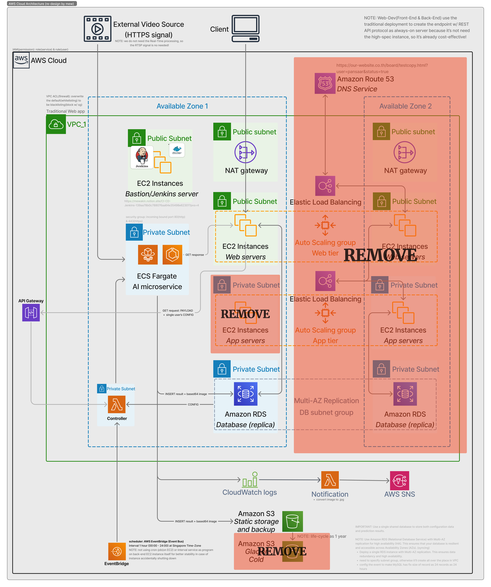
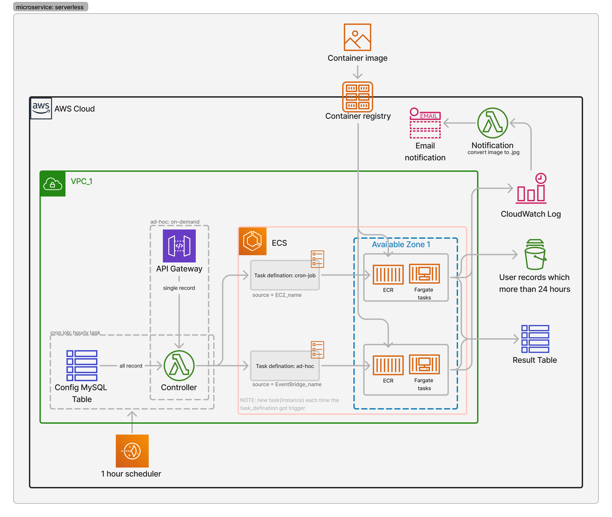
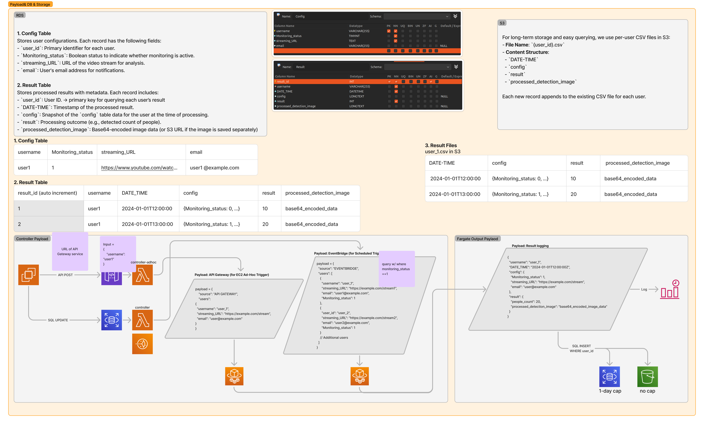
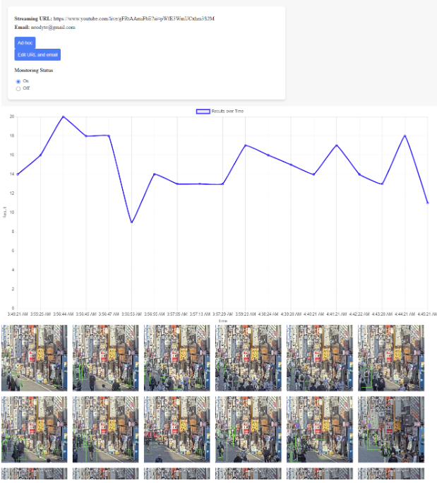
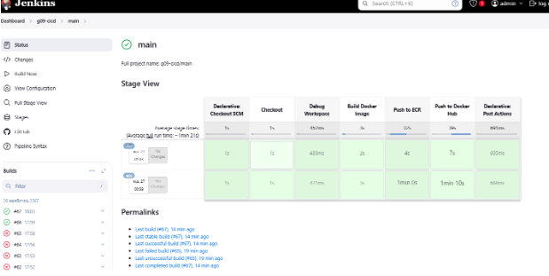

# 🚀AWS Cloud Foot Traffic Detection System🌐

🌟 This project was developed as part of **DES424 Cloud-Based Application Development** at **SIIT**. For more detailed information, refer to my **[70-page final report](https://drive.google.com/file/d/1rBlGcvq5cqi44O8uaULY91kKAz13coyg/view?usp=drive_link)**.

The **AWS Cloud Foot Traffic Detection System** is a scalable and serverless solution designed for real-time foot traffic detection from video streams. Built on top of AWS services like ECS Fargate, Lambda, RDS, and S3, this system provides valuable insights for businesses, security, and event management.

---

🔑 **Key Highlights:**
- 🎥 **Scalable Video Stream Processing**: Tackled challenges like **YouTube bot detection** and processed live video feeds without relying on 3rd-party APIs.
- 💻 **Serverless Architecture**: Built with **AWS Lambda, ECS Fargate, and RDS**, ensuring optimized costs and zero downtime.
- 📊 **Real-Time Dashboard**: A user-friendly interface delivering insights for **market researchers**, **event organizers**, and **security professionals**.
- 🔒 **Secure Design**: Leveraged **IAM Roles** and **VPCs** for robust data privacy and access control.
- 🚀 **CI/CD Excellence**: 70+ Jenkins pipelines later, achieved fully automated deployments for **AWS ECS** microservices.

🎯 **What It Solves:**  
Perfect for **retailers**, **advertisers**, and **security teams** to gain actionable insights from **foot traffic data**.

---

<p align="center">
  
</p>

## **System Overview**

1. **Data Input**:  
   Users provide public video streams & set the config (e.g., YouTube Live links, monitoring_status, email).  

2. **Processing**:  
   AWS Lambda triggers ECS Fargate tasks to process video streams and run model inference(human detection).  
   <p align="center">
      
   </p>

3. **Storage**:  
   - **Short-term (RDS)**: Keeps results for 24 hours for quick access.  
   - **Long-term (S3)**: Archives data for historical analysis.  
   <p align="center">
      
   </p>

4. **Visualization**:  
   - Real-time graphs and foot traffic data displayed on the web app.
   <p align="center">
      
   </p>

5. **Notifications**:  
   Alerts via AWS SNS for more than usual foot traffic event for market researcher

---

## **Key Features**

- **Ad-Hoc Processing**: Real-time processing of specific streams on demand.
- **Scheduled Batch Processing**: Cron jobs for periodic analysis of multiple streams.
- **Web Dashboard**: Intuitive interface for monitoring live foot traffic data.
- **CI/CD Implementation**: Streamlined deployment for ECS via Jenkins pipelines.

---

## **Project Repository Structure**

```
Cloud-Foot-Traffic/
├── assets/                      # Visuals and documents
├── web-app/
│   ├── next-js/                 # Frontend source code
│   └── back-end/                # Backend API
├── microservices/
│   ├── model_inference/         # ECS-based processing
│   └── controller/              # AWS Lambda orchestration
├── IaC/                         # Infrastructure as Code (S3, RDS setup)
├── jenkins/                     # custom Jenkins image & JCasC
└── README.md                    # Project Documentation
```

---

## **Key Resources**

Google Drive: https://drive.google.com/drive/folders/1P6yV9aI1bKGlaxs7SrlwyBsZZYkJzTjZ?usp=sharing

- **Full Report**: [Final Report (70 pages)](https://drive.google.com/file/d/1rBlGcvq5cqi44O8uaULY91kKAz13coyg/view?usp=drive_link)   
- **Jira Board**: [Project Management](https://g9-team-aj3e43gt.atlassian.net/jira/software/projects/KAN/boards/1)

Main GitHub Repository: https://github.com/mewakinHub/Cloud-Foot-Traffic.git

Web Frontend Repository https://github.com/Ranviee0/cloudproject-nextjs

Web Backend Repository https://github.com/Ranviee0/cloudproject-fastapi

---

## **Showcase Videos**

- **jenkinsCICD_showcase**: [jenkinsCICD_showcase](https://drive.google.com/file/d/1Sm06OZ_akNjv-u6LcvOKxH7SV5CDqj_X/view?usp=drive_link)  
- **Cron-Job use case Video Showcase (monitoring & control amount of result to be under 24 records):**: [Control Record Retention](https://drive.google.com/file/d/1iVgGL_udy7SWui6FdIKZ7oPDOWy1Au3-/view?usp=drive_link)  
- **Microservice & SNS video showcase:**: [SNS Workflow Showcase](https://drive.google.com/file/d/1ekpEDhJrw_I10uonSUnt6MQvu-ihAz7u/view?usp=drive_link)

---

## **Deployment Overview**

### **Manual Deployment**  
1. **Frontend/Backend**:  
   Use Dockerfiles in the respective directories for manual builds.  

2. **Microservices**:  
   - Zip the AWS Lambda code and upload directly via AWS Management Console.
   - Deploy ECS images by only building and pushing to DockerHub/ECR. (auto-deploy by ECS task_defination)

### **CI/CD for ECS**  
1. **Pipeline Stages**:  
   - Build Docker image.  
   - Push to DockerHub, then pull and re-tag for ECR.  
   - Push to ECR for ECS consumption.  
   <p align="center">
      
   </p>

- Script:https://docs.google.com/document/d/18c3-dRVuuiK9odD6vbgw0oKpEbt9igGOrSAvWvScrLs/edit?tab=t.31pd1mvun33s
- report doc: https://docs.google.com/document/d/1dEDp034fE9jcF9L7JY-5MPXK0SYEzWsnK3laiJ2QZMA/edit?tab=t.0
- diagram work plan: https://www.figma.com/board/nx2GIUvclLDHjqHL88iSb3/AWS-Cloud-Foot-Traffic---SIIT?node-id=0-1&node-type=&t=2HEotOSCkFqgUvJv-0
